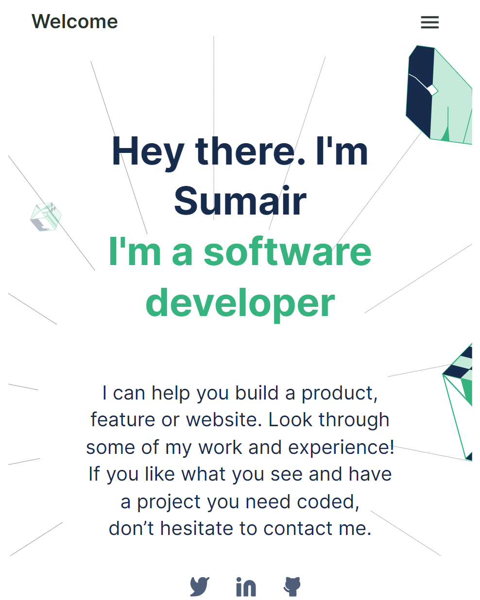

# Personal Portfolio

> This is my personal portfolio website, meant to showcase my skills as a software developer.

## Built With

HTML
CSS

## Getting Started
Just go ahead and clone the repository using the following link.

[Clone from this link!](https://github.com/sumairq/Personal-Portfolio.git) 

## Author

👤 **Sumair Qaisar Jadoon**

- GitHub: [@sumairq](https://github.com/sumairq)
- Twitter: [@sumair_qaisar](https://twitter.com/sumair_qaisar)
- LinkedIn: [LinkedIn](https://linkedin.com/in/sumair-qaisar-jadoon-84a877164)

👤 **Lisandro Seia**

- GitHub: [@lisandroseia](https://github.com/lisandroseia)
- LinkedIn: [LinkedIn](https://www.linkedin.com/in/lisandro-seia-295120225/)

## 🤝 Contributing

Contributions, issues, and feature requests are welcome!

## Show your support

Give a ⭐️ if you like this project!
